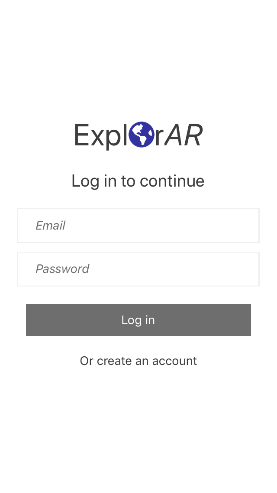

# ExplorAR

ExplorAR is a mobile app that allows you to explore your surroundings - local attractions, restaurants, and bars - in a more spontaneous, interactive, and meaningful way.Whether you just moved to New York City, or you're visiting Chicago the first time, or you just want to rediscover hidden gems in your own neighborhood, Explore AR brings you real-time data, reviews, and insights about points of interest in your area.  

  <img 

This repository contains the front end source code, built using ViroReact, Redux, and React Native. There is a separate git project deployed to Heruku which serves as the backend server (https://github.com/explorAR-group/ExplorAR-Server).

## Installation
Follow the installation guide below to set up and run this source code locally on Mac.

### Prerequisites
1. A mac computer and an iOS Device with A9 chip or higher and running iOS 11 or an [ARCore supported device]
2. On the mobile, download the ViroMedia TestBed App from the apple appstore: https://itunes.apple.com/us/app/viro-media/id1163100576?mt=8

 
### Clone Repo
git clone https://github.com/explorAR-group/ExplorAR
cd ExplorAR

### Install and setup dependencies
npm install
npm start (starts serving the app from the laptop to the mobile testbed app)

### Running the app
1. Run the ViroMedia TestBed app on a mobile phone.
2. Click the top left menu - enter testbed. 
3. Enter the NGROK address into the mobile
4. Login using the test login name: test@admin.com & password: 123
